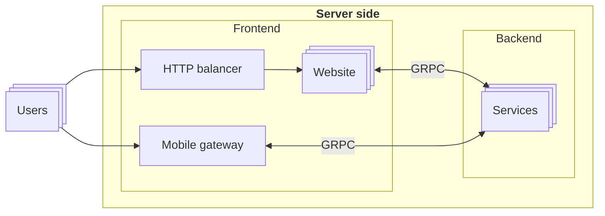

# Wind force

Helper tooling for wind force staff.

- Instructors schedule view and CalDav notifications
- Administrators managment system
- Clients side descktop view

# System architcture

## Components description

### Backend

#### _path_
`components/backend/*`

#### Description

The core of the application. Contains all the logic related to it and provides a gRPC interfasce.

The backend logic is divided into domains called services. Services are connected by Kafka in purpose to keep consistent the backend internal state.

Some services provide a gRPC API. This API is
commonly used by frontend gateways.

#### Services

- _schedule_
    > Domain for instructors' scheduling-related logic

### Website

#### _path_
`components/website`

#### Description

A http website written in deno fresh framework.
It is middleware between the users and actual application logic. The main goal is to serve http requests and render website pages.

### Http balancer

#### _path_
`components/http-balancer`

#### Description

A web users entry point. Proxies HTTP requests to distinct `website` instances and provides a network defense layer.

We use `nginx` to do the HTTP balancer job.

### Mobile gateway

#### _path_
`Not implemented yet`

#### Description

A mobile users entry point. Provides the server-side
 API for mobile apps.
